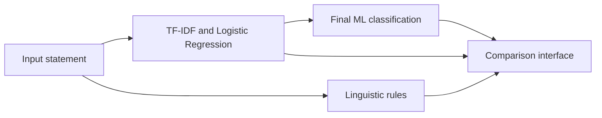

# Misinformation Detection System

A research prototype that compares two lightweight approaches to detecting potentially misleading language: a TF-IDF Logistic Regression classifier and an interpretable rule-based analyser.

The project uses the LIAR political-statement dataset and presents both outputs in a Gradio interface so their behaviour can be compared. It detects learned and linguistic patterns; it does **not** verify claims against evidence or replace professional fact-checking.

## Approaches

### Machine learning

The ML pipeline converts statements into unigram and bigram TF-IDF features, then trains a class-balanced Logistic Regression classifier. The six LIAR labels are mapped to two categories:

- `true` and `mostly-true` become **Truthful**.
- `half-true`, `barely-true`, `false`, and `pants-fire` become **Misleading**.

The ML prediction is used as the prototype's final classification. The interface also reports confidence and the predicted probability of the Misleading class.

### Rule-based analysis

The rule analyser searches for five categories of linguistic indicators: conspiracy language, deceptive claims, sensational language, absolute claims, and strong certainty. Weighted matches produce a transparent heuristic risk score.

The rule result is shown alongside the ML result for interpretation and comparison. It does not override the final ML classification.

## Architecture



## Current evaluation

The baseline Logistic Regression experiment recorded **68.15% validation accuracy on 1,284 LIAR validation statements**. Accuracy alone is insufficient for an imbalanced classification problem, so `evaluate.py` also reports precision, recall and F1-score for both classes and both approaches.

Run the evaluation in your own environment to reproduce the full classification reports:

```bash
python evaluate.py --train-data data/train.tsv --evaluation-data data/valid.tsv
```

Results depend on the documented label mapping, dataset version, random seed and package versions. Reproduced precision, recall and F1 values should be added to this README after running the command; they are not invented here.

## Project structure

```text
app.py                              Gradio interface
evaluate.py                         Reproducible comparison script
misinformation_detection/model.py  Dataset, training and prediction logic
misinformation_detection/rules.py  Interpretable linguistic rules
tests/test_rules.py                 Automated rule and validation tests
data/                               Local LIAR TSV files (not committed)
```

## Setup

1. Clone the repository and enter it.
2. Create and activate a virtual environment.
3. Install the dependencies.

```bash
python -m pip install -r requirements.txt
```

Download the LIAR dataset from its official source and place `train.tsv`, `valid.tsv`, and `test.tsv` inside `data/`.

## Run the interface

```bash
python app.py --train-data data/train.tsv
```

Gradio will print a local address that can be opened in a browser. Add `--share` only when a temporary public Gradio link is required.

## Run tests

```bash
python -m pip install -r requirements-dev.txt
python -m pytest
```

The tests can also run without pytest:

```bash
python -m unittest discover -s tests -v
```

## Limitations and responsible use

- A classification is not a factual verdict and should not be presented as one.
- The LIAR dataset focuses on US political statements and may not generalise to other topics, countries or writing styles.
- Mapping six nuanced labels into two categories removes important context.
- Confidence is model confidence, not certainty that a statement is true or false.
- Linguistic rules can flag truthful text that quotes or discusses suspicious language.
- The system does not retrieve sources, inspect evidence, identify satire, or understand changing real-world facts.
- Dataset imbalance can make accuracy appear stronger than minority-class performance.

The appropriate use is education, model comparison and decision-support research with human review. It should not be used to censor content, accuse individuals of deception, or make high-impact decisions.

## Future improvements

- Record and publish a fully reproducible metrics table.
- Add repeated cross-validation and threshold analysis.
- Add source retrieval and evidence-based claim verification.
- Test fairness and generalisation on South African and multilingual datasets.
- Expose the comparison through a small FastAPI endpoint.
- Add container support after the evaluation workflow is stable.

## Portfolio

Read the project case study at [https://zandiledladla.github.io](https://zandiledladla.github.io).
